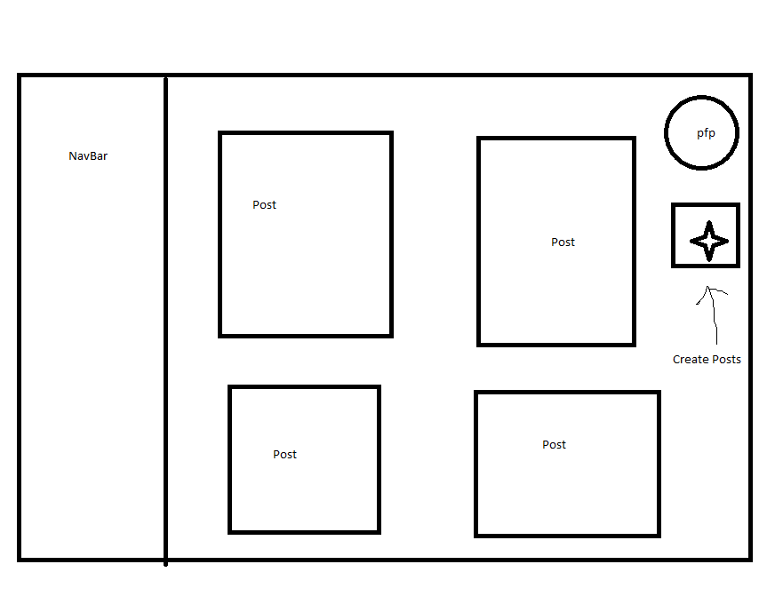

# Travel Tracker App using React and Flask 🧭

## Introduction 😊

The Travel Tracker App called **Waestem** is a web application that empowers users to keep track of their travels and share with others. We aim to provide a robust platform for travelers to document their trips with multimedia like photos, text, and location data. Users can view their posts, comment, like, and share them with friends and family. The app will be built using Flask and React.
## Problem Statement 🚩
Many travelers have a hard time keeping track of their trips and remembering the details of their experiences. Furthermore, it can be challenging to share those experiences with others in a meaningful way. The Travel Tracker App solves these problems by providing an easy-to-use platform for travelers to document their trips, including photos, text, and location data. This app allows users to preserve their memories and share them with others.
## Target Audience 🦗
The target audience for the Travel Tracker App is anyone who loves to travel and wants to document and share their experiences. This includes people of all ages and backgrounds, from solo travelers to families and groups. The app is particularly useful for frequent travelers who want to keep track of their travel history and share it with others.
## Requirements  ⚓
### Functional Requirements 📝
* User registration and login (authentication)
* Create, edit, and delete travel entries
* bility to add photos, text, and location data to travel entries
* View travel history and statistics
* Search for travel entries by location or keyword
* Share travel entries with others via social media
* Non-functional Requirements:
* Responsive UI that works well on different devices and screen sizes
* Secure authentication and data storage
* Fast loading times and smooth performance
### Key Features 🔑
* Easy way for adding and managing travel entries

* Interactive map displaying travel history and locations

* Dynamic search functionality for finding travel entries. 

* Share travel entries with others via social media

## Software Architecture 🏗️

The Travel Tracker App will be built using a 3-tier architecture, consisting of the presentation layer, application layer, and data layer. The presentation layer will handle user interactions with the app and display all the data in the post and user information on the post to the user. The application layer will handle data processing and fetching. The data layer will be responsible for data storage and retrieval. For example, when a user wants to search for something, the presentation layer would request a query with filters to get the corresponding posts. The application will be built using Flask, a Python-based web framework for the application layer. The front end will be developed using React, a popular Javascript framework. The backend will be built using MySQL or SQLite.

## Technology Stack 📚
Front-end Technologies: HTML, CSS, React, JavaScript  

Back-end Technologies: Python, Flask  

Front-end: React, TailwindCSS  

Library/Package: MasonryLayout, react-router-dom, GoogleLogin, etc.

Database: MySQL/SQLite

Hosting: Hostinger
## Team Members 👥

Lane Brantley 🛣️

Joseph Petrongelli 🕵️‍♂️

Shane Li  🏮

Sabin Shrestha 🏔️

Youness Badr 🌊

